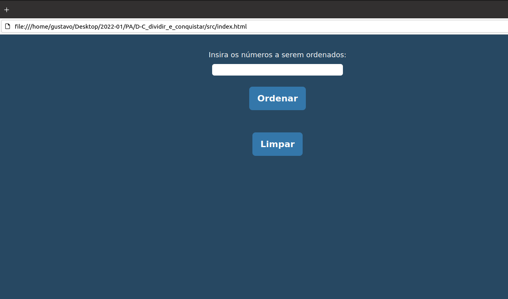

# D-C_dividir_e_conquistar

**Número da Lista**: N/A<br>
**Conteúdo da Disciplina**: D-C<br>

## Alunos
|Matrícula | Aluno |
| -- | -- |
| 19/0027088 |  Eliás Yousef Santana Ali |
| 20/0038141  | Gustavo Duarte Moreira |

## Sobre 
O projeto consiste em um algorítimo de ordenação que recebe uma lista de números em qualquer ordem e utilizando a estratégia de dividir e conquistar para realizar a ordenação.

## Screenshots




## Instalação 
**Linguagem**: javascript<br>
**Framework**: N/A<br>

***Pre-requsitos***

Possuir um navegador de internet instalado na máquina.

## Uso 
**Clonar o repositório**
```
    git clone https://github.com/projeto-de-algoritmos/D-C_dividir_e_conquistar
```
**Entar o repositório**
```
    cd D-C_dividir_e_conquistar/src
```
**Executar o comando**
```
    Abrir o arquivo index.html em um navegador
```
## Outros 
Observação: Os testes foram realizados em dois computadores um no sitema operacional UBUNTU 20.04 e outro no Windows 10.


## Video

[Video da apresentação](video/D-C_dividir_e_conquistar.mp4)
